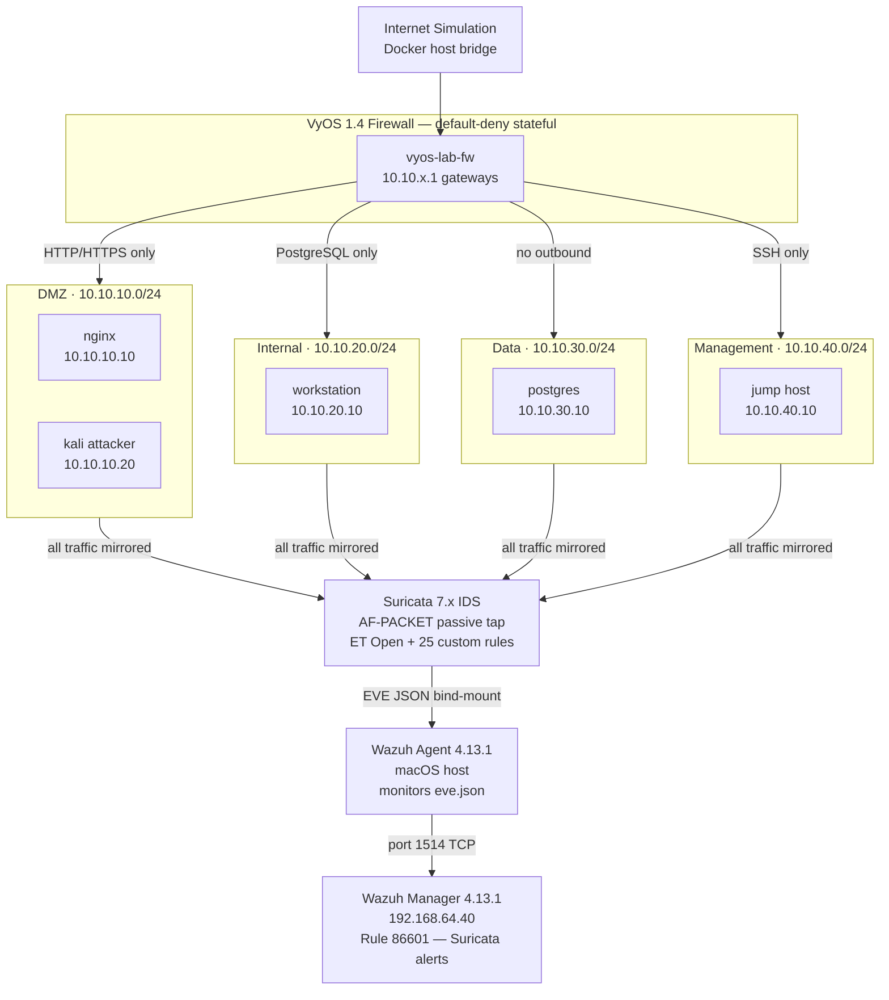
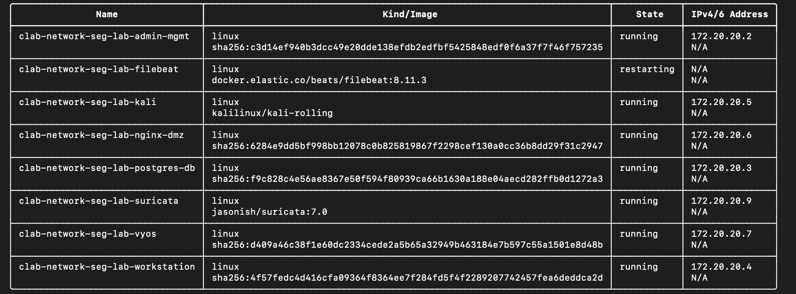
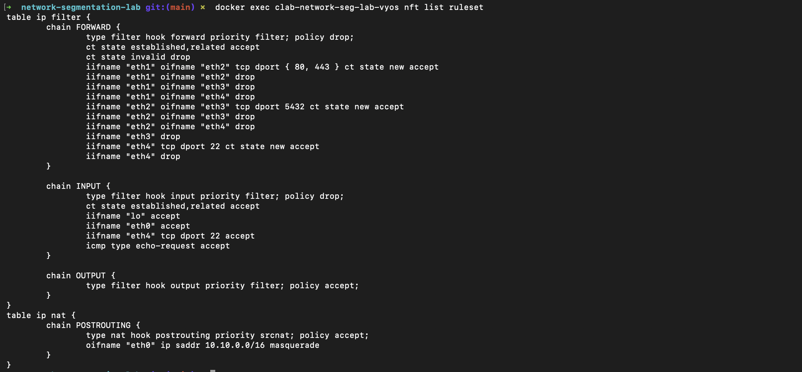
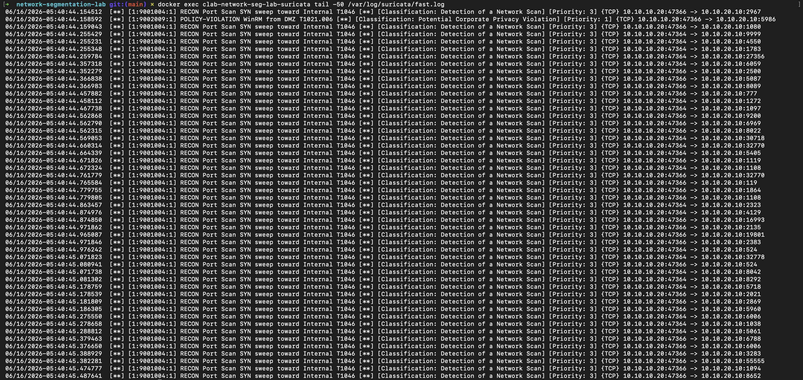
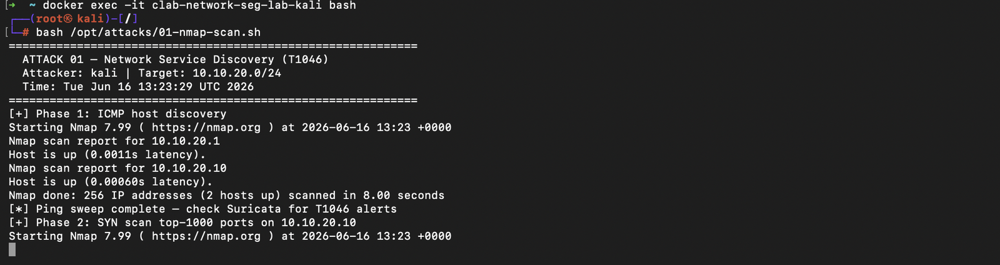

# Multi-Zone Network Segmentation Lab

**VyOS 1.4 firewall · Suricata 7.x IDS · Containerlab orchestration · Wazuh integration · Apple Silicon native**

A defense-in-depth lab demonstrating lateral movement detection across 4 segmented network zones,
integrated with an existing SOC Detection Lab Wazuh manager for unified host + network telemetry.

> **Part of a 10-project cybersecurity portfolio** — see
> [SOC Detection Lab](https://github.com/sahilsinghi/soc-detection-lab) for the host-telemetry
> companion project that feeds the same Wazuh dashboard.

---

## Architecture



---

## Evidence

| Lab Running | Firewall Policy |
|-------------|-----------------|
|  |  |

| Suricata Alerts (149 total) | Attack Execution |
|-----------------------------|-----------------|
|  |  |

---

## Quick Start

### macOS / Apple Silicon note

Containerlab has no native macOS binary — it requires Linux kernel network namespaces.
On macOS, the included `scripts/clab` wrapper runs containerlab inside Docker Desktop's
Linux VM, where the binary works normally. All commands below use this wrapper.

### Prerequisites

Docker Desktop for Apple Silicon must be running.

### First-time setup

```bash
git clone https://github.com/sahilsinghi/network-segmentation-lab
cd network-segmentation-lab

# Build all custom lab images (firewall, endpoints)
make build

# Pre-pull large remote images (Kali ~3 GB — do this before a timed demo)
make pull
```

### Configure Wazuh endpoint

Install the Wazuh agent on the macOS host running this lab, then add the Suricata localfile block to `/Library/Ossec/etc/ossec.conf`:

```xml
<localfile>
  <log_format>json</log_format>
  <location>/path/to/network-segmentation-lab/logs/suricata/eve.json</location>
  <label key="lab">network-seg-lab</label>
</localfile>
```

Restart the agent: `sudo /Library/Ossec/bin/wazuh-control restart`

See [`docs/wazuh-integration.md`](docs/wazuh-integration.md) for full setup details and the Filebeat production-grade alternative.

### Deploy

```bash
# Build custom images + deploy full lab (< 5 minutes after initial pulls)
make deploy

# Or deploy manually if images are already built
./scripts/clab deploy -t topology.clab.yml
```

### Inspect and tear down

```bash
# Show running nodes and management IPs
make inspect

# Tail live Suricata alerts
make logs

# Tear down cleanly
make destroy
```

---

## Firewall Policy Matrix

| Source → Destination | Permitted | VyOS Rule |
|---------------------|-----------|-----------|
| DMZ → Internal | TCP 80, 443 | DMZ-TO-INTERNAL |
| DMZ → Data | **DENY** | DMZ-TO-DATA |
| DMZ → Management | **DENY** | DMZ-TO-MGMT |
| Internal → Data | TCP 5432 | INTERNAL-TO-DATA |
| Internal → Management | **DENY** | INTERNAL-TO-MGMT |
| Data → Any | **DENY** (no outbound init) | DATA-OUTBOUND |
| Management → All | TCP 22 | MGMT-TO-ALL |

Full matrix with verification commands: [`docs/firewall-policy.md`](docs/firewall-policy.md)

---

## Attack Simulations

Run all attacks from inside the Kali container:

```bash
docker exec -it clab-network-seg-lab-kali bash
```

| # | Script | MITRE Technique | VyOS Action | Suricata SIDs |
|---|--------|----------------|-------------|---------------|
| 01 | `01-nmap-scan.sh` | T1046 Network Service Discovery | Forward HTTP only | 9001004, 9001005 |
| 02 | `02-smb-lateral.sh` | T1021.002 SMB Lateral Movement | **BLOCK** port 445 | 9001001, 9001002, 9001014 |
| 03 | `03-ssh-bruteforce.sh` | T1110.001 Password Guessing | **BLOCK** SSH from DMZ | 9001011 |
| 04 | `04-dns-tunnel.sh` | T1048.003 DNS Exfiltration | Allow (DNS not blocked) | 9001007, 9001008 |
| 05 | `05-reverse-shell.sh` | T1059.004 Unix Shell | Block outbound return | 9001009, 9001010 |
| 06 | `06-icmp-covert.sh` | T1095 ICMP Covert Channel | Allow (ICMP diagnostic) | 9001012, 9001013 |

Attack execution log with expected vs actual outcomes: [`tests/execution_log.md`](tests/execution_log.md)

---

## Custom Suricata Rules

15 rules covering lateral movement TTPs specific to this zone topology:

```
suricata/custom-rules/lateral-movement.rules    # SIDs 9001001–9001015
suricata/custom-rules/policy-violations.rules   # SIDs 9002001–9002010
```

Example rule — SMB enumeration from DMZ (T1021.002):

```
alert tcp $DMZ_NET any -> $INTERNAL_NET 445 \
  (msg:"LATERAL-MOVE SMB Enumeration from DMZ to Internal T1021.002"; \
   flow:established,to_server; \
   content:"|FF|SMB"; depth:9; offset:4; \
   classtype:policy-violation; \
   sid:9001001; rev:1; \
   metadata:mitre_technique_id T1021.002;)
```

---

## Wazuh Integration

Suricata EVE JSON is forwarded to the **existing Wazuh manager from the SOC Detection Lab** via the macOS Wazuh agent. No new SIEM deployment. Two data sources, one dashboard:

- **Host telemetry:** Sysmon events from SOC Lab Windows agent
- **Network telemetry:** Suricata EVE JSON from this lab (Rule 86601)

**Validated:** `POLICY-VIOLATION RDP from DMZ T1021.001` (sid:9002005) triggered by nmap from Kali → Wazuh Rule 86601 fired on the manager within seconds.

See [`docs/wazuh-integration.md`](docs/wazuh-integration.md) for the full pipeline and setup steps.

---

## Definition of Done Checklist

- [ ] `containerlab deploy -t topology.clab.yml` completes in < 5 minutes
- [ ] VyOS enforces policy matrix — verified with nmap from each zone
- [ ] Suricata writes EVE JSON to `logs/suricata/eve.json`
- [x] Wazuh agent ships Suricata EVE JSON to Wazuh Manager — Rule 86601 fires within seconds
- [ ] All 6 attack simulations run with documented outcomes in `tests/execution_log.md`
- [ ] At least 3 simulations show correlated alerts in both Suricata and Wazuh
- [ ] Threat model maps all controls to MITRE ATT&CK technique IDs
- [ ] Architecture diagram + 5 screenshots in README
- [ ] 90-second Loom demo recorded

---

## Screenshots

| Screenshot | What It Shows |
|-----------|---------------|
| `screenshots/01-topology.png` | `containerlab inspect` showing all nodes running |
| `screenshots/02-vyos-policy-log.png` | VyOS firewall drop log for SMB from DMZ |
| `screenshots/03-suricata-alert.png` | Suricata EVE JSON alert — SID 9001004 |
| `screenshots/04-wazuh-correlated-event.png` | Wazuh dashboard — Suricata alert visible |
| `screenshots/05-attack-execution.png` | Kali terminal — attack script output |

> **Note:** Screenshots are added after first successful run. Use `docs/execution_log.md` for
> placeholder guidance.

---

## Threat Model

Full MITRE ATT&CK mapping for every VyOS rule and Suricata signature:
[`docs/threat-model.md`](docs/threat-model.md)

---

## Project Structure

```
network-segmentation-lab/
├── topology.clab.yml           # Containerlab — single file brings up full lab
├── vyos/
│   ├── bootstrap-config.boot   # VyOS 1.4 startup config (zone firewall policies)
│   └── policy-matrix.md
├── suricata/
│   ├── suricata.yaml           # Suricata 7.x config (AF-PACKET, EVE JSON)
│   ├── custom-rules/
│   │   ├── lateral-movement.rules    # 15 rules, MITRE-tagged (SIDs 9001xxx)
│   │   └── policy-violations.rules   # 10 rules, zone policy (SIDs 9002xxx)
│   └── README.md
├── filebeat/
│   └── filebeat.yml            # Ships EVE JSON to Wazuh manager
├── endpoints/
│   ├── nginx-dmz/              # DMZ web server
│   ├── workstation-internal/   # Internal Ubuntu + SMB
│   ├── postgres-data/          # Data zone PostgreSQL
│   └── admin-mgmt/             # Management jump host
├── tests/
│   ├── attacks/                # 6 documented attack scripts
│   └── execution_log.md        # Expected vs actual outcomes
├── docs/
│   ├── architecture.md         # Mermaid diagram + design rationale
│   ├── ip-plan.md
│   ├── firewall-policy.md      # Full allow/deny matrix with VyOS references
│   ├── threat-model.md         # MITRE ATT&CK control mapping
│   ├── wazuh-integration.md    # Suricata → Wazuh pipeline (validated)
│   └── cross-portfolio-bridge.md  # How this feeds the SOC Lab Wazuh instance
└── screenshots/
```

---

## ARM64 Notes (Apple Silicon)

- **Containerlab:** Linux-only binary — `scripts/clab` wrapper runs it inside Docker Desktop's Linux VM
- **VyOS sagitta:** Multi-arch image — runs natively on M1/M2/M3
- **Kali:** `kalilinux/kali-rolling` is multi-arch ARM64 native
- **Suricata:** `jasonish/suricata:7.0` is multi-arch ARM64 native
- **pfSense alternative:** pfSense has no ARM64 build — VyOS is the correct choice here

> **Why not a native macOS containerlab binary?** Containerlab requires Linux kernel primitives
> (network namespaces, veth pairs, Linux bridges) that macOS does not expose. Docker Desktop
> provides those primitives inside its embedded Linux VM, which is exactly where `scripts/clab` runs.

---

## v2 Roadmap

- Switch DMZ Suricata interface to IPS mode (inline drop)
- Add Zeek for richer L7 protocol logging (conn.log, dns.log, http.log)
- Add OPNsense as parallel deployment for keyword coverage
- Add Tetragon (eBPF) for pod/container-level network policy
- Integrate with AWS VPC Flow Logs once cloud project is shipped

---

## Related Projects

| Project | Link | How It Connects |
|---------|------|-----------------|
| SOC Detection Lab | [github.com/sahilsinghi/soc-detection-lab](https://github.com/sahilsinghi/soc-detection-lab) | Shares Wazuh manager — host-side TTPs |
| SOAR Alert Triage | _(coming)_ | Automates alert triage from this lab's Wazuh alerts |
| APT Threat Actor Profiler | [github.com/sahilsinghi/apt-threat-actor-profiler](https://github.com/sahilsinghi/apt-threat-actor-profiler) | Maps detected TTPs to threat actor profiles |

---

*Built by [Sahil Singhi](https://github.com/sahilsinghi) · Apache 2.0 License*
