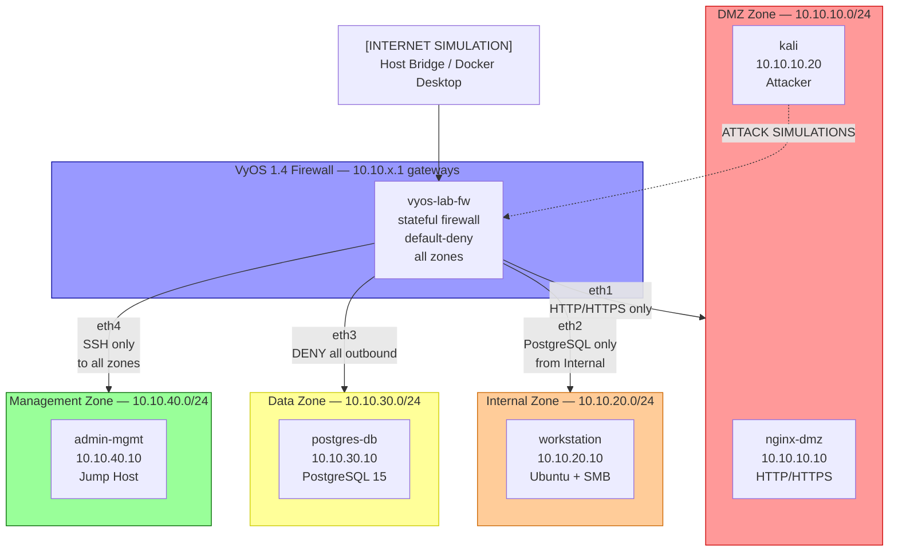
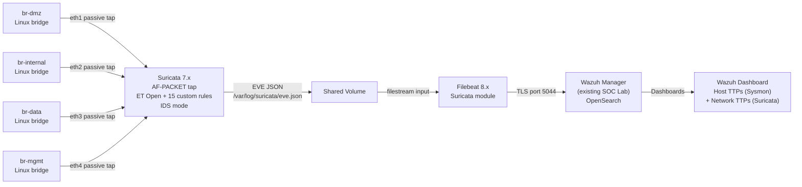

# Architecture — Multi-Zone Network Segmentation Lab

## Overview

The lab simulates a defense-in-depth enterprise network with four security zones, enforced by a
VyOS stateful firewall and monitored by a Suricata IDS. All components run as Docker containers
orchestrated by Containerlab on Apple Silicon.

## Zone Topology

## Detection Plane

## Component Design Rationale

### VyOS 1.4 (sagitta) — Firewall/Router

**Why VyOS over pfSense:** VyOS is CLI-driven (set/commit/save pattern) — closer to real
Cisco IOS/Junos experience. Demonstrates infrastructure-as-code thinking since the entire
firewall config lives in `vyos/bootstrap-config.boot` as a text file. pfSense uses a web UI
which doesn't diff cleanly in git and has no native ARM64 build.

**Firewall architecture:** Zone-based stateful policy. Each zone interface has an inbound policy
chain that default-denies and explicitly allows the minimum required traffic. Established/related
return traffic is handled by a shared RETURN-TRAFFIC chain applied outbound on each interface.

### Containerlab — Orchestration

**Why Containerlab over GNS3/EVE-NG:** Containerlab is declarative (topology YAML, not a GUI),
ARM64-native, and reproducible in under 5 minutes from a single `containerlab deploy` command.
GNS3/EVE-NG require GUI setup and don't represent how modern infrastructure-as-code teams
run network labs. Containerlab is used by Cloudflare, Arista, and Nokia for network CI/CD.

**Bridge topology:** Each security zone is a Linux bridge. VyOS connects to all four bridges
(one per zone). Endpoints connect to their zone bridge only. Suricata connects to all four
bridges as a passive tap — it sees all inter-zone traffic without being in the forwarding path.

### Suricata 7.x — IDS

**IDS not IPS for v1:** In IDS mode, Suricata alerts without dropping packets. This makes the
detection logic easier to reason about — you can see what Suricata *would* have blocked
separately from what VyOS *does* block. v2 can switch eth1 to IPS mode for the DMZ interface.

**ET Open ruleset:** The Emerging Threats Open ruleset provides ~40,000 production signatures
updated daily. Downloaded via `suricata-update` at container start. The 15 custom rules in
`custom-rules/lateral-movement.rules` cover TTPs specific to this lab's zone topology.

**AF-PACKET capture:** Suricata uses Linux's AF-PACKET socket for zero-copy packet capture.
Each zone interface is captured independently, allowing per-zone threshold tracking.

### Wazuh Integration

**Reusing SOC Lab Wazuh manager:** No new SIEM deployment needed. Filebeat ships EVE JSON
to the existing Wazuh manager on port 5044 (logstash-compatible input). The Suricata Filebeat
module handles field mapping. In Wazuh, Suricata alerts appear under the "Suricata" decoder
group alongside Sysmon events from the SOC Detection Lab — two data sources, one dashboard.

**Unified detection story:** Host-side TTPs (Sysmon process creation, registry modification)
come from SOC Lab agents. Network-side TTPs (cross-zone lateral movement, DNS exfil) come from
this lab's Suricata. Correlating by timestamp and source IP in Wazuh's OpenSearch dashboard
reconstructs the full kill chain.

## Security Zones — Design Decisions

| Zone | Trust Level | Internet Egress | Rationale |
|------|------------|-----------------|-----------|
| DMZ | Untrusted | Allowed (simulated) | Public-facing; attacker's initial beachhead |
| Internal | Low-trust | Via VyOS only | Simulates employee workstations |
| Data | Isolated | **NONE** | Database tier must never initiate connections |
| Management | High-trust | Via VyOS | Admin access requires deliberate action |

The key architectural insight: **the Data zone has no outbound route**. An attacker who
compromises the database container cannot exfiltrate data via TCP/UDP. The only viable
exfil paths are DNS (if DNS egress is permitted) and ICMP (always permitted for diagnostics)
— both of which Suricata explicitly monitors with custom rules 9001007, 9001012.
